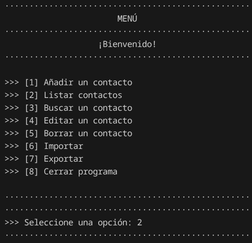
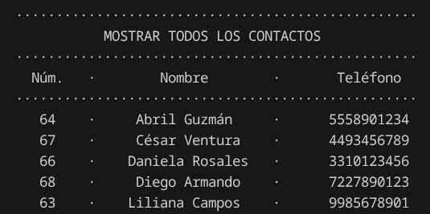
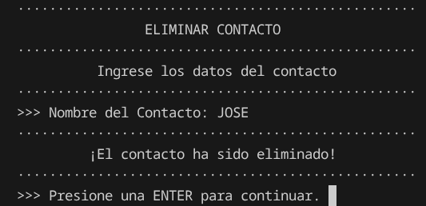
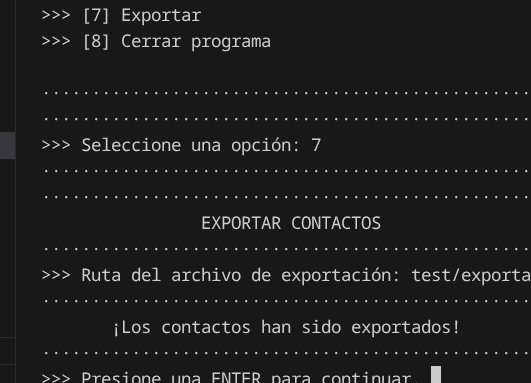
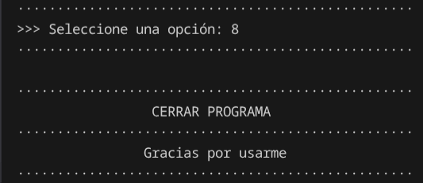
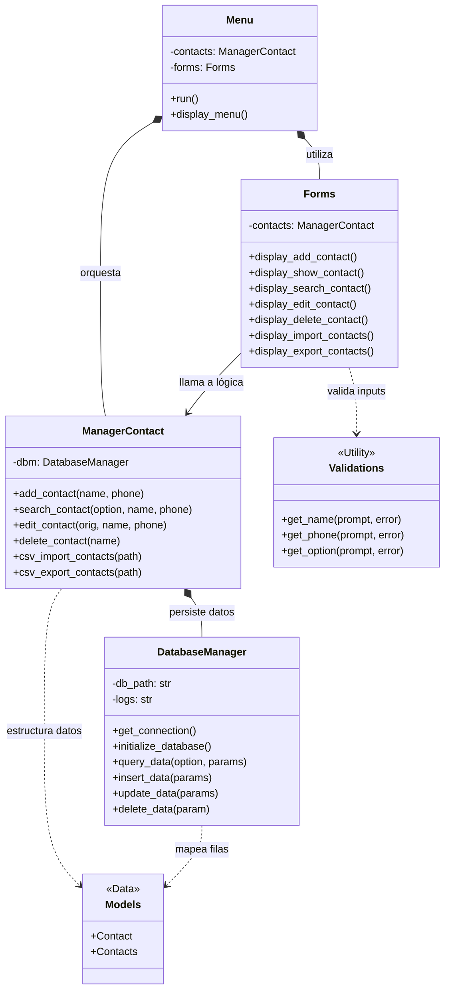

# Agenda de Contactos

Agenda de Contactos realizado en `Python` utilizando Programación Orientada a Objetos (`POO`), utilizando modularización, gestionando una base de datos en `SQLite` y validando entradas del usuario.



> Menú



> Ventana de Listar contactos



> Ventana de Eliminar un contacto



> Ventana de Exportar contactos



> Cierre del programa

## Base de Datos

He utilizado `SQlite` para la persistencia de los datos. He utilizado una tabla bastante sencilla para ello:

| id | name | phone |
|----|------|-------|
|1|CONTACTO1|1231231234|
|2|CONTACTO2|3213213214|

## Detalles del programa

La estructura del programa se muestra en el diagrama realizado con `mermaid`:



## Instrucciones de uso

1. Clona el repositorio. Para ello, ejecuta el siguiente comando:

```
git clone https://github.com/rosendocamal/contact-manager.git
```

2. Ubícate en la carpeta principal del repositorio y ejecuta:

```
python3 app.py
```

3. Sigue las intrucciones del menú interactivo.

## Tecnologías y herramientas


 


## Licencia

Este proyecto está licenciado bajo la Licencia MIT. Para más detalles consulta el archivo [LICENSE](LICENSE).

## Autor

Proyecto desarrollado por **Rosendo Camal**.

Contacto:
* [GitHub](https://github.com/rosendocamal)
* [Linkedin](https://www.linkedin.com/in/rosendocamal)